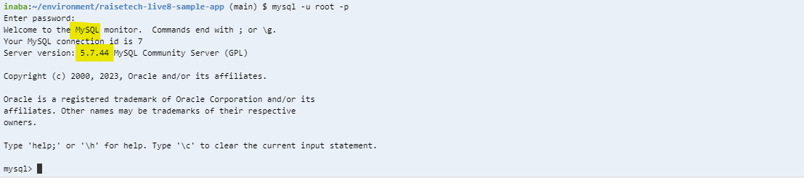

### 第３回講座課題

- **課題1．APサーバーについて調べる**
    - **APサーバー名**：Puma　**バージョン**：5.6.5  
        
    - **APサーバーの停止**  
          
        
    - **APサーバーの再開**  
        
- **課題2．DBサーバーについて調べる**
    - **DBサーバー名**：MySQL　**バージョン**：5.7.44  
        
    - **DBサーバーの停止**  
        
    - **Railsの構成管理ツール名**：Bundler  
        

- **課題3．第3回講座課題から学んだこと**

- **各システムのインストール方法**
    - **Ruby**：Webサービスやアプリケーションに使用される、オブジェクト指向スクリプト言語。  
     ver3.1.2を使用、**RVM**を使用しインストールした。
    - **RVM**(Ruby Version Manager)：複数のRuby実行環境の管理を簡単にするツール。
        - ` ruby -v`：Rubyのバージョンを確認
        - ` rvm install 3.1.2` ：Ruby 3.1.2 をインストール
        - ` rvm use 3.1.2` ：Ruby 3.1.2 にバージョンを変更
    - **Ruby on Rails**：Rubyのフレームワーク。    
     ver7.0.4を使用、今回は使用しなかったが**gem**でバージョンのインストールを行う。
    - **gem**：Rubyのパッケージ、またはパッケージ管理ツール（RubyGems）。
        - ` gem install rails -v 7.0.4` ：Rails 7.0.4 をインストール
        - ` rails -v` ：Railsのバージョンを確認
        - ` gem info rails` ：インストール済みのRailsを確認
        - ` rails _7.0.4_ new "アプリ名"` ：Rails 7.0.4 を使用
    - **Bundler**：gemの依存関係やバージョンを管理するツール。gemの一種。  
     ver2.3.14を使用、**gem**を使用しインストールした。
        - ` gem install bundler`： bundlerをインストール
        - ` bundle -v` ：bundlerのバージョンを確認
    - **Node.js**：Webページ作成などに使われるJavaScriptをサーバー側で動作させるプラットフォーム。  
     ver.17.9.1を使用、**NVM**を使用しインストールした。
    - **NVM**(Node Version Manager)：Node.jsのバージョンを管理するためのツール。
        - `nvm install 17.9.1`：Node.jsのインストールとバージョンを変更
        - `node -v`：Node.jsのバージョンを確認
    - **npm**(Node Package Manager)：JavaScriptのパッケージ管理システム。
    - **Yarn**：**npm**と同様であるが、高速になっている。  
     ver1.22.19を使用、**npm**を介してインストールした。
        - `npm install -g yarn@1.22.19`：Yarn 1.22.19をインストール
        - `yarn -v`：Yarnのバージョンを確認
- **データベース管理システムの準備**
    - **MySQL**：オープンソースのSQLリレーショナルデータベース管理システム。  
     今回はMariaDBを削除し、MySQL8.0をインストールした。
    - **RDB**(Relational Database)：表形式の複数データを関連付けて使えるようにしたデータベース。
        - `sudo cat /var/log/mysqld.log | grep "temporary password" | awk '{print $13}'`：  
         MySQLのログファイルから一時パスワードを抽出
        - `mysql -u root -p`：rootユーザーとしてMySQLにログイン
        - `ALTER USER 'root'@'localhost' IDENTIFIED BY '設定するパスワード';`：  
         ルートユーザーのパスワードを変更
        - `FLUSH PRIVILEGES;`：特権の変更を反映
- **サンプルアプリケーションのデプロイ**
    - **Permission**：ユーザーがファイルやディレクトリに対して持つ権限やアクセス制御の設定。  
     今回はbin/cloud9_devのPermissionが-rw-rw-r--となっていたためアクセス権限を変更した。
        - `ls -la bin`：[bin]の情報を表示する
        - `sudo chmod 775 bin/cloud9_dev`：[cloud9_dev]のアクセス権限を755（rwxr-xr-x）に変更
    - Brocked hostが表示された際の対応
        - `config.hosts << "ホスト名"`：指定のホストを追加
- **APサーバーについて調べる**
    - **APサーバー**：アプリケーションプログラムを動作させるサーバー  
     今回はPuma version: 5.6.5を使用
    - **Puma**：最小限のWEBサーバと**Rack**を提供するAPサーバ
    - **Rack**：WEBサーバとRubyで作られたWEBフレームワークを繋ぐインターフェース
        - `rails s`：Railsの起動
        - `ctrl+C`：プログラムの停止
- **DBサーバーについて調べる**
    - **DBサーバー**：データを一元管理し、データの検索、更新、保存、バックアップ を行うサーバ
        - `sudo service mysqld stop`：MySQLの停止
        - `sudo service mysqld start`：MySQLの起動

- **課題3．第3回講座課題にて感じたこと**
    - 学習方法について  
    今回の課題の進め方は、講座の録画を見ながらデモプレイを真似てみることから始めました。  
    最初にサンプルアプリケーションをデプロイした時点では、正直殆ど理解出来ていなかったです。  
    課題提出にあたり、学習内容をまとめる段階で一つずつ用語を調べることで、  
    今回の講座内容を理解することが出来ました。（まだわからない点の方が多いですが）  
    学習の進め方として正解か不明ですが、今後も同様に進めていこうと思います。