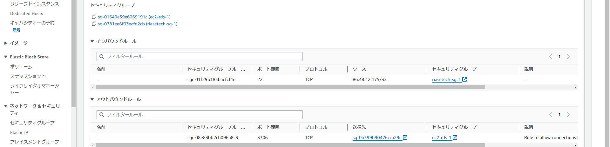
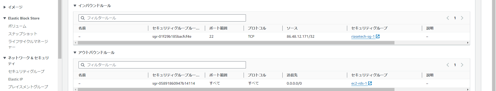
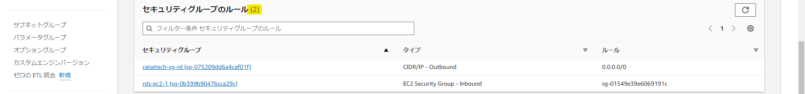
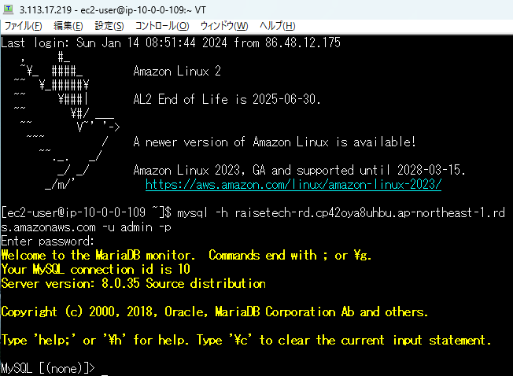

# 第4回講座課題

## VPCの作成

- **ルートテーブル(private)**  

- **ルートテーブル(public)**  

## EC2の作成

- **セキュリティグループ＜修正前＞**  

    - アウトバウンドの設定が重複していたため、RDSにだけ接続できるように修正しました。
    
    
    - アウトバウンドは全てを開放し、インターネットへも接続できるように修正しました。
    

## RDSの作成

- **セキュリティグループ**  

    - EC2に対する設定と混同しておりマイIPからの接続を許可していたため、削除しました。
    

- **サブネットグループの作成**  

## EC2からRDSへの接続

## 所感

- 学んだこと  
    - VPC／EC2／RDSについて、作成時に必要な用語を理解できました。
    - 上記3つのサービスを手動作成することが可能になりました。
    - VPC内の構造についてイメージが付くようなりました。
- 困難だったこと
    - セキュリティグループを理解することに時間が掛かりました。
    - 特にRDS関連のセキュリティグループやサブネットグループの紐づけ等が難しかったです。
    - 課金対象範囲の確認に時間が掛かってしまいました。
- 課題の修正について
    - セキュリティグループの内容が重複していたり、不要な設定をしていました。
    - 今回の課題を実施するうえでの必要最低限な設定に修正しました。
    - 修正後、EC2からRDSへの接続を確認できております。  
    