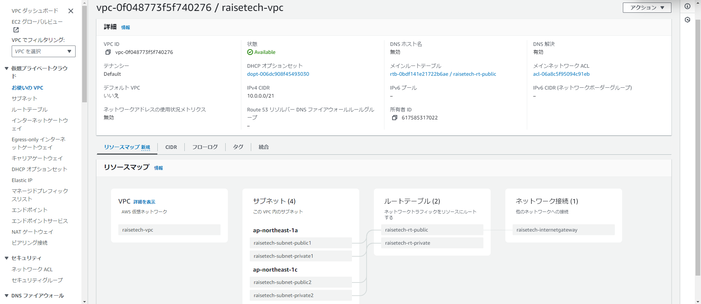
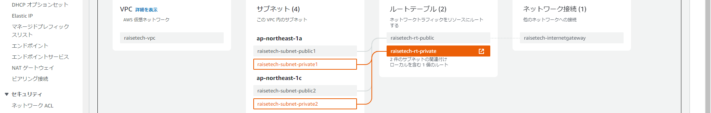
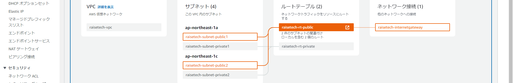
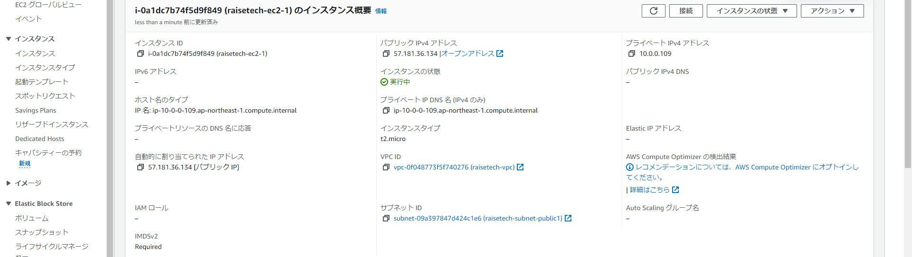
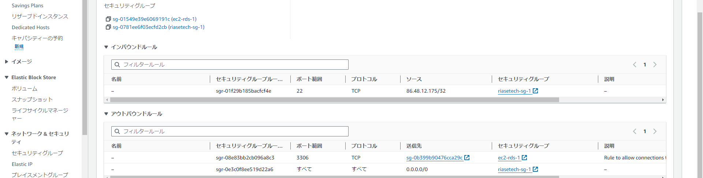
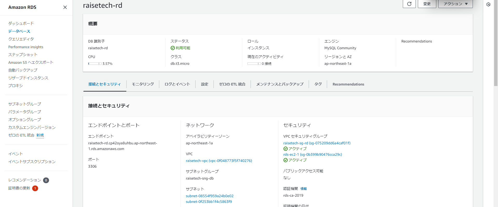
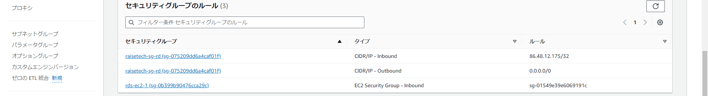
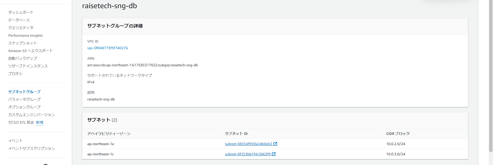
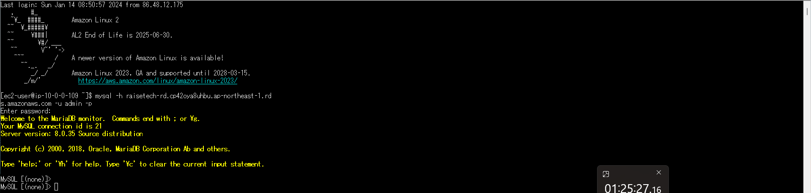

## 
第4回講座課題

### 
VPCの作成

- **ルートテーブル(private)**  

- **ルートテーブル(public)**  

### 
EC2の作成

- **セキュリティグループ**  

### 
RDSの作成

- **セキュリティグループ**  

- **サブネットグループの作成**  

## 
EC2からRDSへの接続

## 
所感

- 学んだこと  
    - VPC／EC2／RDSについて、作成時に必要な用語を理解できました。
    - 上記3つのサービスを手動作成することが可能になりました。
    - VPC内の構造についてイメージが付くようなりました。
- 困難だったこと
    - セキュリティグループを理解することに時間が掛かりました。
    - 特にRDS関連のセキュリティグループやサブネットグループの紐づけ等が難しかったです。
    - 課金対象範囲の確認に時間が掛かってしまいました。