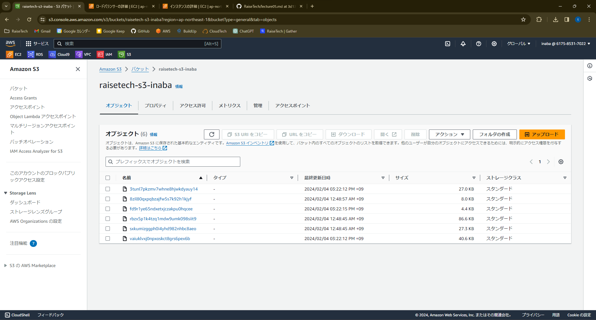
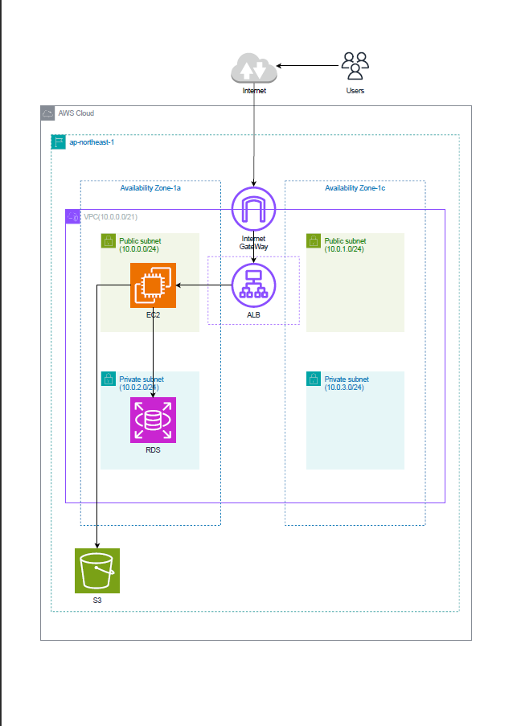

# 第5回講座課題

## 組み込みサーバーだけでサンプルアプリケーションのデプロイ

- **デプロイした際のログ**  

- **表示されたＷＥＢページ**  

- **RDSへ保存されていることを確認した際のスクショ**  

## サンプルアプリケーションを分けてデプロイ

- **Nginxのアクセスログ（画像保存時）**  

- **Unicorn起動時のログ**  

- **画像保存時のＷＥＢページ**  

- **S3の追加**  

## ELBの追加

- **ALBの設定**  

## 構成図

- **今回作成した環境の構成図**  

### 設定ファイル群（証跡）

- **nginx**  

- **unicorn**  

- **Gemfile**  

- **storage**  

- **development**  

### 所感

- エラーが何度も発生し、その度にChatGPTに確認しながら作業を行っていました。
- どうしても分からなかった時にメンターの方へ相談し方向性を教えていただきました。

- 今後は時間を決めて、詰まったときは積極的に相談したいと思います。
- 今回は課題提出までに17日間（４０時間程度）掛かってしまいました。
- 次回以降はスピードを上げていきたいです。