# 第6回講座課題

## CloudTrailにて最後に利用した日の記録をピックアップ

- **イベント履歴画面**  
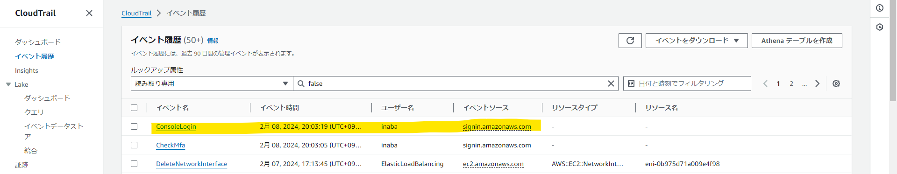

- **イベントの中に含まれる情報**  
    - イベント名　　：ConsoleLogin
    - ユーザー名　　：inaba
    - イベント時間　：2月 08, 2024, 20:03:19 (UTC+09:00)
    - イベントソース：signin.amazonaws.com
    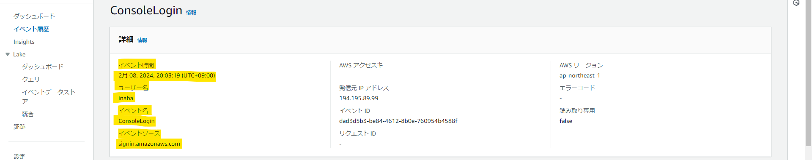

## CloudWatch ALBアラームの設定

- **Amazon SNSの設定詳細**  
    - 指定のGmail宛てにメール通知が来るように設定  
    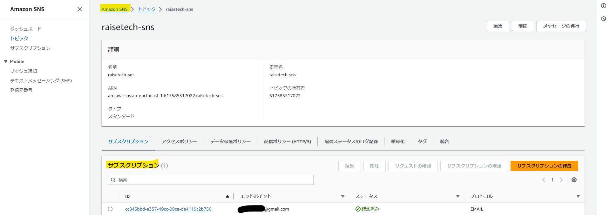

- **CloudWatch ALBアラームの設定詳細**  
    - メトリクス ：raisetech-alb6（ALB）/UnhealtyHostCount  
    - TargetGroup：raisetech-tg（ALBで設定されたTargetGroup）  
    - しきい値　 ：300秒あたり1以上  
    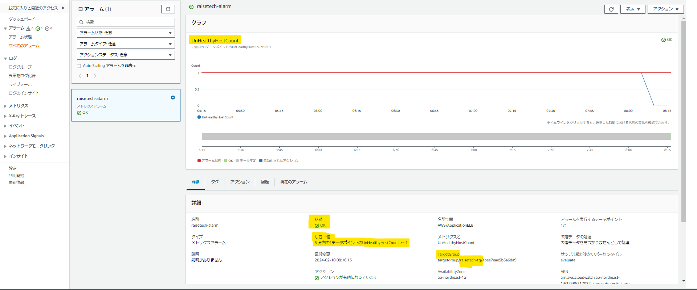  
    - アクション ：OK/アラーム状態時に「raisetech-sns」にメッセージ送信  
    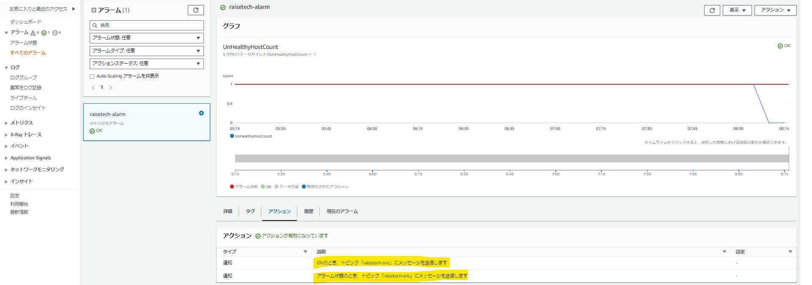

- **Nginx/Unicorn起動時の挙動**  
    - ALB配下のEC2のヘルスステータスが「Healthy」に遷移する  
    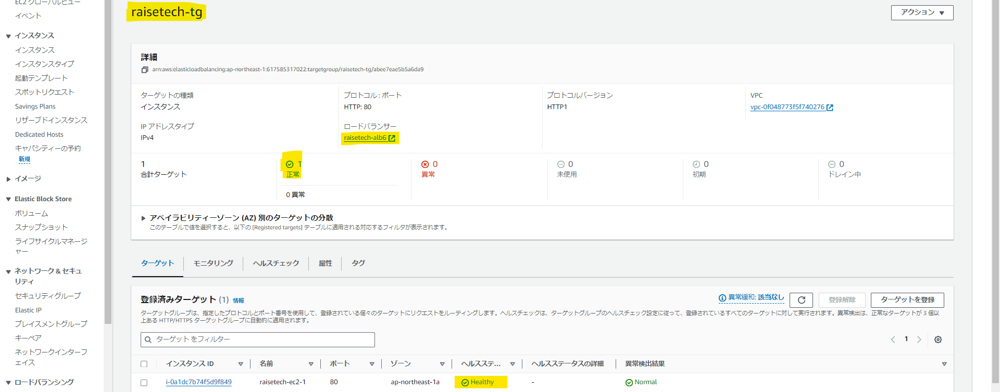
    - ALBアラームの状態が「OK」に遷移する  
    
    - メールに通知  
    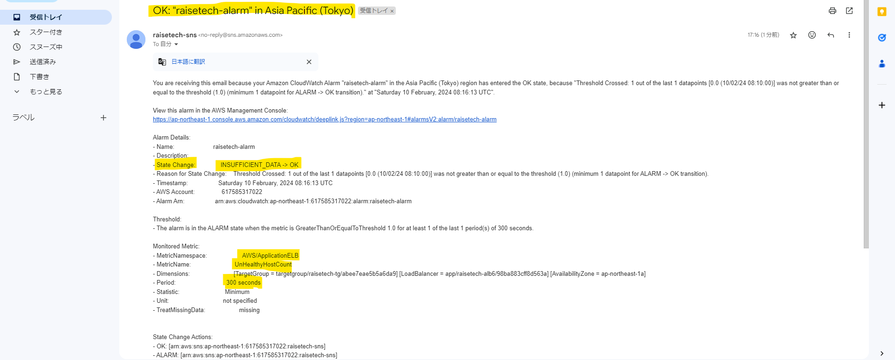

- **Nginx/Unicorn停止時の挙動**  
    - ALB配下のEC2のヘルスステータスが「Unhealthy」に遷移する  
    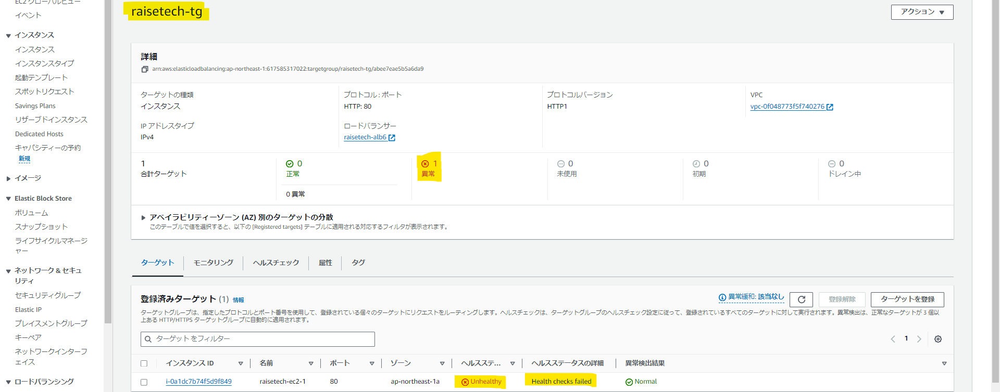
    - ALBアラームの状態が「アラーム状態」に遷移する  
    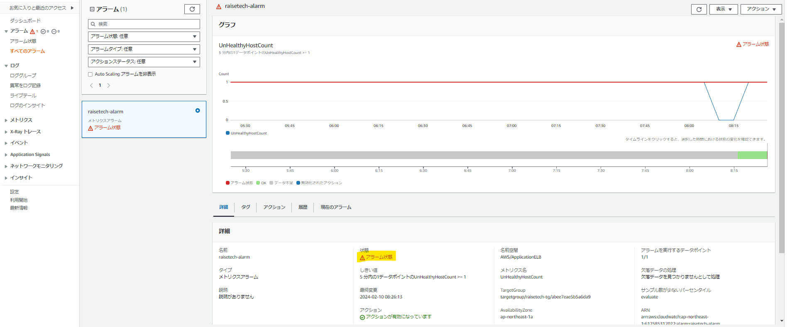
    - メールに通知  
    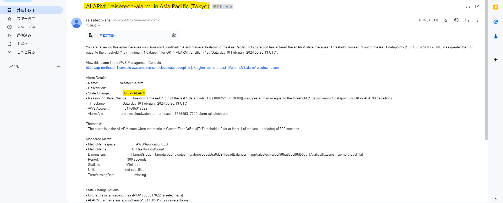

## AWS 利用料の見積を作成

- **AWS Pricing Calculatorにて作成**  
    - URL：https://calculator.aws/#/estimate?id=554e1587dc666d0494af254cf6dc74fde32d2090  
    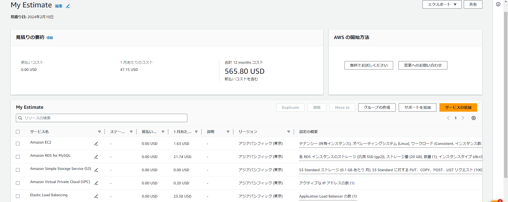

## AWS利用料の確認

- **1月分の請求書を確認**  
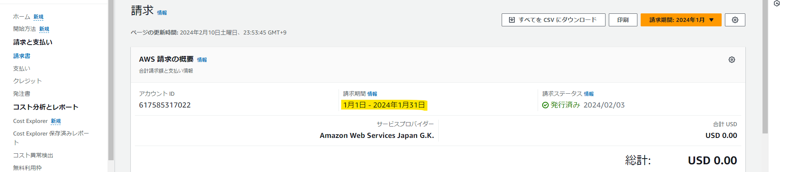

- **EC2の利用料が無料利用枠で収まっていることを確認**  
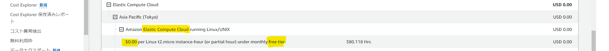